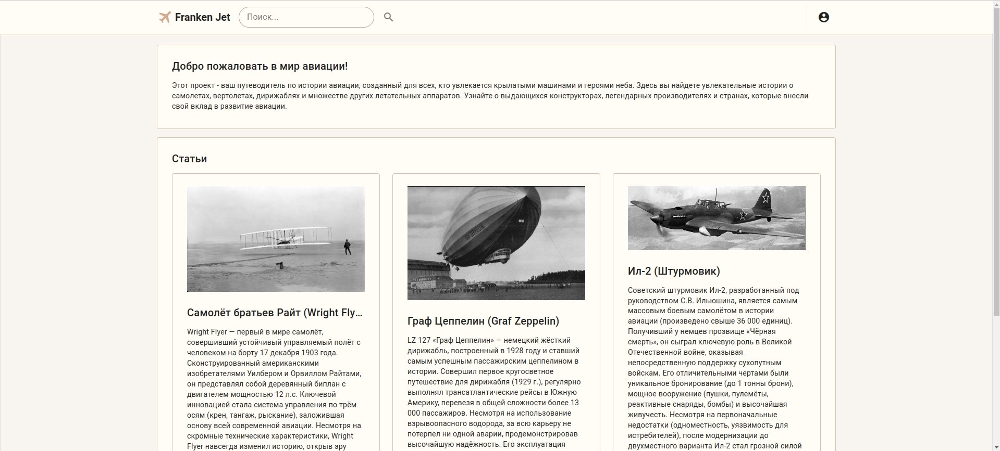
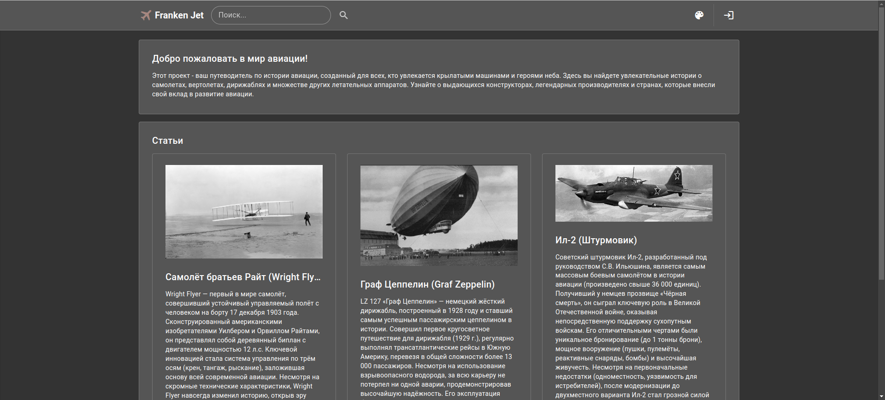
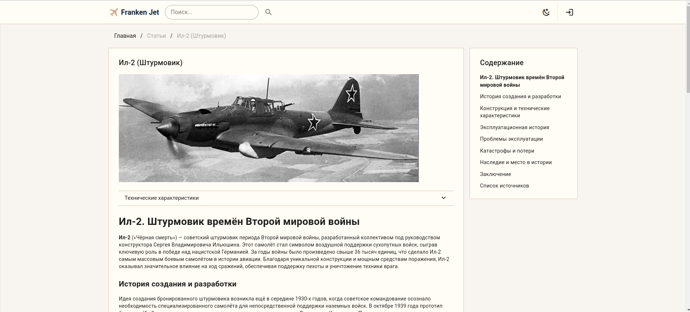
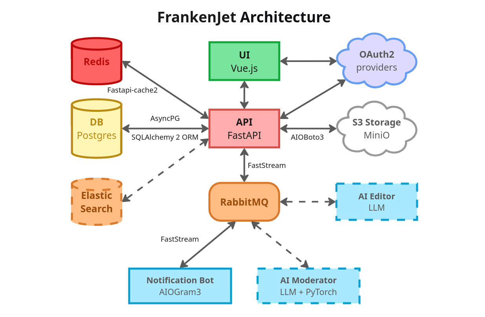

# FrankenJet. Энциклопедия истории авиации

## О проекте

**FrankenJet** - это проект, целью которого является предоставить пользователям удобный и информативный ресурс об истории авиации. Это путешествие по захватывающему миру воздушных судов, конструкторов и событий, сформировавших воздушную историю человечества.







### Технологии

Fullstack: FastAPI (backend) + Vue.js 3.5 (frontend).

* **Backend:**
  * Python 3.12, PostgreSQL 17 (AsyncPG, SQLAlchemy 2 ORM), API (async FastAPI, WebSocket, AIOHTTP), S3 MiniO (AIOBoto3), RabbitMQ (FastStream).
* **Frontend:**
  * Vue.js 3.5, Vite, Vuetify, Axios, Pinia, Vue Router.
* **Microservice (бот уведомлений):**
  * Python 3.12, AIOGram3, FastStream.
* **Запуск и управление сервисами:**
  * Docker, Docker compose.
* **Линтеры:**
  * Ruff, MyPy.

### Архитектура проекта



### Общая структура проекта

```
📦 franken-jet
├─ 🗂️ backend                  # Основной backend (FastAPI)
│  ├─ 📁 alembic               # Миграции
│  ├─ 📁 app                   # Основной исходный код бэкенда
│  │  ├─ 📁 api                # Маршруты FastAPI
│  │  ├─ 📁 config             # Конфигурация приложения
│  │  ├─ 📁 consumers          # Consumer брокера сообщений RabbitMQ
│  │  ├─ 📁 core               # Основные модули, контекстные мереджеры
│  │  ├─ 📁 db                 # Модели и репозитории базы данных
│  │  ├─ 📁 dependencies       # Компоненты Dependency Injections
│  │  ├─ 📁 exceptions         # Исключения
│  │  ├─ 📁 schemas            # Pydantic-схемы
│  │  └─ 📁 services           # Сервисный слой (бизнес-логика)
│  ├─ 📁 scripts               # Скрипты инициализации приложения при запуске через docker-compose
│  ├─ 📄 alembic.ini           # Настройка alembic
│  ├─ 📄 Dockerfile            # Определение контейнера бэкенда
│  ├─ 📄 example.env           # Пример файла переменных окружения бэкенда
│  ├─ 📄 main.py               # Точка входа в приложение (backend)
│  └─ 📄 README.md             # Документация бэкенда
│
├─ 🗂️ frontend                 # Web-приложение (Vue.js)
│  ├─ 📁 public                # Публичные файлы, доступные напрямую
│  ├─ 📁 src                   # Основной исходный код фронтенда
│  │  ├─ 📁 assets             # Статические ресурсы проекта
│  │  ├─ 📁 components         # Переиспользуемые компоненты Vue
│  │  ├─ 📁 plugins            # Плагины Vue, маршруты, настройки Axios
│  │  ├─ 📁 stores             # Хранилища состояний (Pinia), логика аутентификации
│  │  ├─ 📄 App.vue            # Корневой компонент приложения
│  │  ├─ 📄 main.js            # Точка входа в приложение (frontend)
│  │  └─ 📄 vuetify.config.js  # Конфигурация Vuetify
│  ├─ 📄 Dockerfile            # Определение контейнера фронтенда
│  ├─ 📄 example.env           # Пример файла переменных окружения фронтенда
│  ├─ 📄 index.html            # Главная HTML-страница
│  ├─ 📄 package.json          # Зависимости, скрипты и метаданные проекта
│  ├─ 📄 README.md             # Документация фронтенда
│  └─ 📄 vite.config.js        # Конфигурационный файл для Vite (сборщика проекта)
│
├─ 🗂️ notifications            # Телеграм-бот уведомлений (Aiogram)
│  ├─ 📁 app                   # Основной исходный код бота
│  │  ├─ 📁 bot                # События, обработчики, клавиатуры бота
│  │  ├─ 📁 broker             # Обработчики сообщений из RabbitMQ
│  │  └─ 📁 core               # Основные модули: логи, конфигурация
│  ├─ 📄 bot.env               # Файл переменных окружения для запуска бота через docker-compose-bot.yml
│  ├─ 📄 Dockerfile            # Определение контейнера бота
│  ├─ 📄 main.py               # Точка входа в приложение бота
│  └─ 📄 README.md             # Документация бота
│
├─ 🗂️ volumes                  # Директория для томов при запуске приложения через docker compose
│
├─ 📄 docker-compose.yml       # запуск лёгкой версии приложения (без бота уведомлений и RabbitMQ)
├─ 📄 docker-compose-bot.yml   # версия приложения с RabbitMQ и ботом уведомлений 
└─ 📄 README.md                # Общая документация
```

### Реализовано

* **Backend:**
  * Аутентификация с использованием access и refresh jwt (через email/пароль и через учётную запись Google).
  * Авторизация пользователей исходя из их ролей.
  * Модели базы данных для хранения информации о пользователях, токенах, статьях, воздушных судах, конструкторских бюро, конструкторах и производителях.
  * API для получения данных по каждой категории (статьи, воздушные суда, и т.д.).
  * Настроены миграции через alembic для разных режимов работы приложения.
  * Сделаны контекстные менеджеры базы данных, RabbitMQ и S3, сделан менеджер для работы с WebSocker.
  * Сделаны скрипты (запускаются в docker compose) для:
    * создания и инициализации базы данных;
    * добавления первичных данных и статей в базу данных;
    * настройки бакетов и добавления изображений в S3.
* **Frontend:**
  * Автоматический запрос на перевыпуск пары access/refresh-токенов.
  * Базовая структура веб-приложения:
    * главная страница с выводом 3-х случайных статей и 5-ю интересными фактами;
    * страница статей с техническими характеристиками воздушных судов.
  * Сделано содержание статей с навигацией.
  * Реализованы различные цветовые схемы (в т.ч. тёмная тема), сделано переключение между ними.
  * Адаптивный дизайн (версия для десктоп, планшета, телефона).
  * Вывод метаданных для SEO-оптимизации.
* **Микросервисы:**
  * Бот оповещений и получения уведомлений об аутентификации администратора и о новых комментариях для модерации с обратной связью с бэкендом (через RabbitMQ).

### Планируется (roadmap)

* **Backend:**
  * Добавить менеджер AIOHTTP.
  * Добавить модели/api персоналий и исторических событий.
  * Добавить задачи (Celery).
  * Добавить кэширование (Redis).
  * Добавить CI/CD.
  * Добавить тесты.
  * Добавить мониторинг.
* **Функциональность:**
  * Профиль пользователя.
  * Глобальный поиск по всем разделам.
  * Фотогалерея.
  * Аутентификация через VK, Yandex, Telegram.
  * Система исправления неточностей в карточках и статьях.
  * Система комментирования и оценок статей.
  * Встроенный редактор статей.
* **Энциклопедия:**
  * Добавление карточек:
    * Статей.
    * Воздушных судов.
    * Конструкторских бюро.
    * Конструкторов.
    * Персоналий.
    * Интересных исторических событий.
* **Микросервисы:**
  * AI-модератор комментариев.
* **Безопасность:**
  * Автоматическое завершение сеансов с подозрительной активностью.

## Как запустить проект

Убедитесь, что у вас установлены Docker и Docker Compose.

1. Клонируйте репозиторий:
   ```
   git clone https://github.com/Dmitry178/FrankenJet.git
   ```

2. Запуск приложения
   * лайт-версия без Rabbit MQ и бота уведомлений:
     ```
     docker-compose up -d --build
     ```
   * полная версия:
     * откройте `/notifications/bot.env`
     * добавьте свой telegram id и токен телеграм-бота:
       ```
       TELEGRAM_ADMIN_ID=ваш_telegram_id
       TELEGRAM_API_TOKEN=токен_вашего_бота
       ```
     * запустите:
       ```
       docker-compose -f docker-compose-bot.yml up -d --build
       ```

3. Откройте приложение в браузере:
    ```
    http://localhost:3100
    ```

4. Остановка приложения
   * лайт-версия без Rabbit MQ и бота уведомлений:
     ```
     docker-compose down
     ```
   * полная версия:
     ```
     docker-compose -f docker-compose-bot.yml down
     ```

### Данные по умолчанию

* База данных:
  * порт: 5436
  * база: fj
  * пользователь: fj_user
  * пароль fj_pass
* MiniO:
  * порт (api): 9910
  * порт (console): 9911
  * пользователь: admin
  * пароль: password
  * url: http://localhost:9910
* RabbitMQ:
  * порт (AMQP): 5676
  * порт (Web UI): 15676
  * пользователь: admin
  * пароль: password
  * url: http://localhost:15676
* Backend:
  * порт: 8100
  * логин администратора: admin
  * пароль администратора: password
  * url (Swagger UI): http://localhost:8100/docs
* Frontend:
  * порт: 3100
  * url: http://localhost:3100

## Автор

Дмитрий Одегов ([Dmitry178](https://github.com/Dmitry178))
